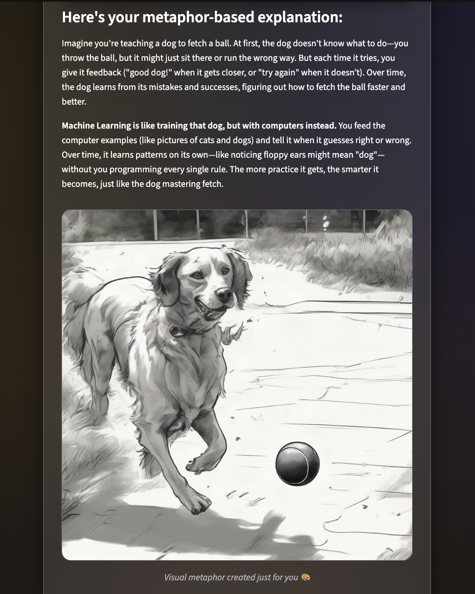

# Magic Metaphors

💡✨ **Turn tough ideas into simple stories with a touch of magic!**

A clean, robust Streamlit application that transforms complex topics into clear metaphor-based explanations and pairs them with vivid AI-generated visuals. 

---

## Example

Type in a topic like "Machine Learning" and get back a plain-language metaphor plus a matching AI-generated illustration:



---

## Features

* **Topic Input**: Enter any complex concept (e.g., Quantum Entanglement, Black Holes).
* **Text Generator**: Powered by top-tier models (DeepSeek-V3 / open alternatives) to write simple, intuitive metaphorical explanations. Focuses on explanations fitting for a high school level.
* **Visual Generator**: Powered by Stable Diffusion (`stable-diffusion-xl-base-1.0`) to craft a surreal, breathtaking image that matches your generated text. Uses the completely free Hugging Face Serverless Tier.
* **Sleek Custom UI**: Features a beautiful glassmorphic UI, responsive custom CSS, Google Fonts integration (Inter), and a dark, calming background.
* **Robust Backend**: Includes a built-in retry-loop strategy directly in the API call logic to automatically survive network blips or timeouts during peak usage.
* **Download Your Image**: Every generated illustration comes with a one-click download button.
* **Basic Rate Limiting**: A short cooldown between "Explain" clicks protects your free-tier Hugging Face quota from accidental rapid-fire requests.
* **No Leaky Errors**: If a request fails, you see a clean, friendly message -- the real exception details are logged server-side only, never shown in the UI.

---

## Installation

1. **Clone the repo:**
   ```bash
   git clone https://github.com/Sonali-b23/magic-metaphors.git
   cd magic-metaphors
   ```

2. **Create and activate a virtual environment (optional but recommended):**
   ```bash
   python -m venv venv
   source venv/bin/activate  # On Windows: venv\Scripts\activate
   ```

3. **Install dependencies:**
   ```bash
   pip install -r requirements.txt
   ```

4. **Add your Environment Variables! (VERY IMPORTANT):**
   Copy `.env.example` to `.env` and add your own Hugging Face API key:
   ```bash
   cp .env.example .env
   ```
   *(Note: `.env` is safely ignored by git across commits -- only `.env.example`, with a placeholder, is committed.)*
   ```env
   HF_API_KEY=your_huggingface_key_here
   ```

---

## Usage

Run the app locally:
```bash
streamlit run app.py
```

---

## Running Tests

Tests mock the Hugging Face client entirely, so they run without a real API key and make no network calls.

```bash
pip install -r requirements-dev.txt
pytest tests/ -v
```

Covers: successful generation, empty-topic validation, a failed metaphor never triggering an image call, a failed image still showing the metaphor, the retry/backoff logic, the rate-limit cooldown, and a regression guard ensuring error messages never leak raw exception text to the UI.

---

## Project Structure

* `app.py` — Main Streamlit app containing all Glassmorphic CSS styling and UI Elements.
* `model.py` — Backend integration (Hugging Face / text and image model logic / retry behavior).
* `tests/` — Automated tests (`pytest` + Streamlit's `AppTest` harness); see "Running Tests" above.
* `requirements.txt` — Python dependencies (`streamlit`, `huggingface_hub`, `python-dotenv`, `Pillow`).
* `requirements-dev.txt` — Adds `pytest` on top of `requirements.txt`, for running the test suite.
* `.env.example` — Template for the `.env` file you create locally; safe to commit (no real key).
* `.gitignore` — Filters out environment files and Python caching directories.
* `README.md` — Project Instructions

---

## Deployment
This app can be deployed easily on platforms like **Streamlit Community Cloud**, Heroku, or Render. Make sure to define your `HF_API_KEY` inside the Cloud platform's Secrets/Environment Variables tab.

---

## Contributing
Contributions welcome! Open issues or pull requests for improvements or fixes.

---

## License
MIT License.

---

## Author
Made with ❤️ by Sonali
